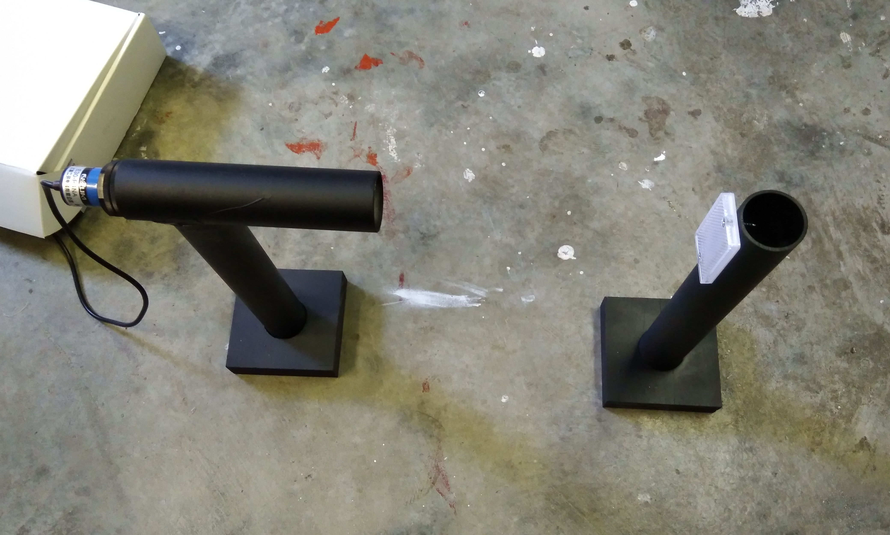

# rad-gate
Arduino powered BMX gate controller with spoken cadence and random start

Main changes from dfrencham/rad-gate project (Thank you Danny for sharing your code) are:

1. "Reaction time" function. This produces a voice message and readout of time from 
gate drop to front wheel tripping the reaction time sensor. ( An IR light beam in my case)
 mp3 files are provided for the announcements.
2. Basic low battery voltage monitor and alarm
3. 4 Digit seven segement LED display for display of "reaction time" and voltage display on low voltage. See 
https://tronixlabs.com.au/display/led/numeric/four-digit-seven-segment-display-module-and-enclosure-australia/
for more information on the display
3. Option to configure gate activation polarity, and option to provide a short pulse for gate activation eg as is required
by a solenoid rather than an electromagnet
4. Some rewrite of timing code to incorporate the above and adhere to UCI timing document.
5. Alter "abort" code to indicate and prevent progress of sequence asap
6. Change to FastLED library to simpify options of LightTree
7. Added 'randomness' to prevent same random sequence on each start up

Major Hardware Components.

1. Arduino UNO R3 (Others should work)
2. Arduino UNO sheild - or some circuit board to mount everything on
3. 4 Digit 7 segment LED display (communicates directly with 74HC595s) (eBay)
4. Audio amplfier eg PAM8610 module (with volume)  (AliExpress)
5. MP3 player JQ6500 (16P)  (AliExpress)
  Or Adafruit Soundboard  (untested)
6. Solenoid - KingWay 50 lb (AliExpress)
7. Light beam transmitter/receiver E30-R4NA (AliExpress)
8. Optional RF receiver- can parallel contacts with "Go" switch
9. Options for Light Tree - Serial eg Neopixel or similar  (search WS2812 Aliexpress) or Individual (4) outputs

Additional information on using E30-R4NA sensor.
The E30-R4NA Infra Red Tx/Rx unit is relatively cheap and works up to a range of about 2.5m from my tests. It does however require some additional hardware to effectively narrow the beam so that a narrow bmx tyre will interrupt the beam sufficiently to trigger the receive circuit. I have done this by mounting the module in a 170mm length of 40mm diameter PVC water pipe as follows.

